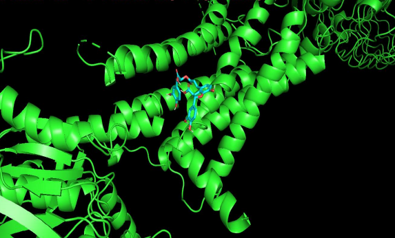
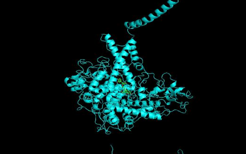
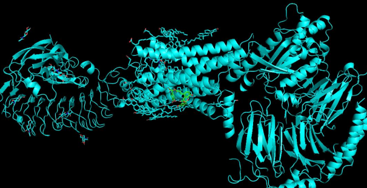

# Molecular-Docking-Lithospermum
Molecular docking analysis of plant-derived compounds using AutoDock Vina

# Screening and Evaluation of Phytoconstituents of Lithospermum officinale for Thyroid Drug Targets

## 🔬 Project Highlights
- Molecular docking analysis of plant-derived compound Lithospermic acid
- Targeted thyroid-related proteins (TSH receptor, Thyroid peroxidase, Thyroglobulin)
- Comparative study with FDA-approved anti-thyroid drugs
- Identified strong binding affinity suggesting potential therapeutic application

## 🧬 Overview
This project focuses on evaluating phytoconstituents of *Lithospermum officinale* for their potential anti-thyroid activity using molecular docking.

The ligand Lithospermic acid was docked against multiple thyroid-related protein targets to analyze binding affinity and interaction patterns.

## 🧪 Tools Used
- AutoDock Vina
- AutoDock Tools
- PyMOL
- RCSB PDB
- PubChem

## ⚙️ Methodology

### 1. Protein Selection
- Retrieved thyroid-related protein structures from RCSB PDB:
  - 7UUY (Thyroid Peroxidase)
  - 7XW5 (TSH receptor)
  - 6SCJ (Thyroglobulin)

### 2. Ligand Preparation
- Selected Lithospermic acid from PubChem
- Downloaded 3D structure in SDF format

### 3. Docking Procedure
- Converted structures to .pdbqt format
- Defined grid box parameters
- Performed docking using AutoDock Vina
- Selected best binding pose based on lowest binding energy

### 4. Visualization
- Visualized protein–ligand interactions using PyMOL

## 📊 Results

### 🔹 Binding Energy (Plant Compound)
- 7UUY → **-8.6 kcal/mol**
- 7XW5 → -8.2 kcal/mol
- 6SCJ → -6.9 kcal/mol

### 🔹 Binding Energy (Standard Drugs)
- Methimazole → ~ -4.5 kcal/mol
- Propylthiouracil → ~ -3.9 kcal/mol
- Carbimazole → ~ -3.2 kcal/mol

### Docking Visualization

## 🧪 Key Findings
- Lithospermic acid showed stronger binding affinity compared to standard drugs
- Best interaction observed with Thyroid Peroxidase (7UUY)
- Negative binding energies indicate stable protein–ligand interactions
- Suggests potential use as a lead compound for anti-thyroid drug development

## 🧠 Skills Demonstrated
- Molecular Docking
- Structural Bioinformatics
- Drug Discovery Concepts
- Protein-Ligand Interaction Analysis

## 📌 Conclusion
The study demonstrates that phytoconstituents of *Lithospermum officinale*, particularly Lithospermic acid, exhibit promising anti-thyroid activity and may serve as potential candidates for future drug development.

## Author
Harini R
